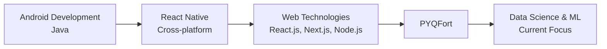

# Hi 👋, I'm Saumy (सौम्य)

## 💼 Professional Experience

<b>🎯 Project Admin - Social Summer of Code (Present)</b>

 

**Microsoft Azure & Reskill**
- Managing nationwide open-source contributions and coordinating with contributors
- Implementing GitHub-based project management best practices

<b>📈 Marketing Team Member - Brixx Fest (Aug 2024)</b>

 

- Optimized sponsor outreach strategy for fashion show event
- Developed GitHub-based activity organization system, enhancing team efficiency for contact management and interaction tracking
- Adapted open-source platforms for collaborative marketing project management

<b>🌟 Open Source Contributor (Oct 2024 — Jun 2025)</b>

 

- **GirlScript Summer of Code** (October 2024)
- **Social Winter of Code** (January 2025)
- **PYQFort** (June 2025 – Present)

## 🌟 Professional Journey

## 🏆 Featured Project

### 🎓 PYQFort - Democratizing Education

  
  
  

**Impact:** Helping Indian students by providing free exam preparation resources with 49+ contributors

**A small contribution to nation by:**
- 🏫 Merging 40+ colleges nationwide to PYQFort
- 👥 Managing community of 49+ contributors
- 📚 Developing comprehensive software solution
- 🛠️ Implementing GitHub project management

---

  

## 🛠️ Tech Stack

### Languages

  

### Frontend Development

  
  

### Backend & Database

  

### Tools & Platforms

  

### Currently Learning

  
  
  
  

---

## 📊 GitHub Analytics

  
  

---

## 🤝 Let's Connect

  

---

## 💡 Featured Contributions

  

*Thanks for visiting! Let's build something amazing together.* 🚀

